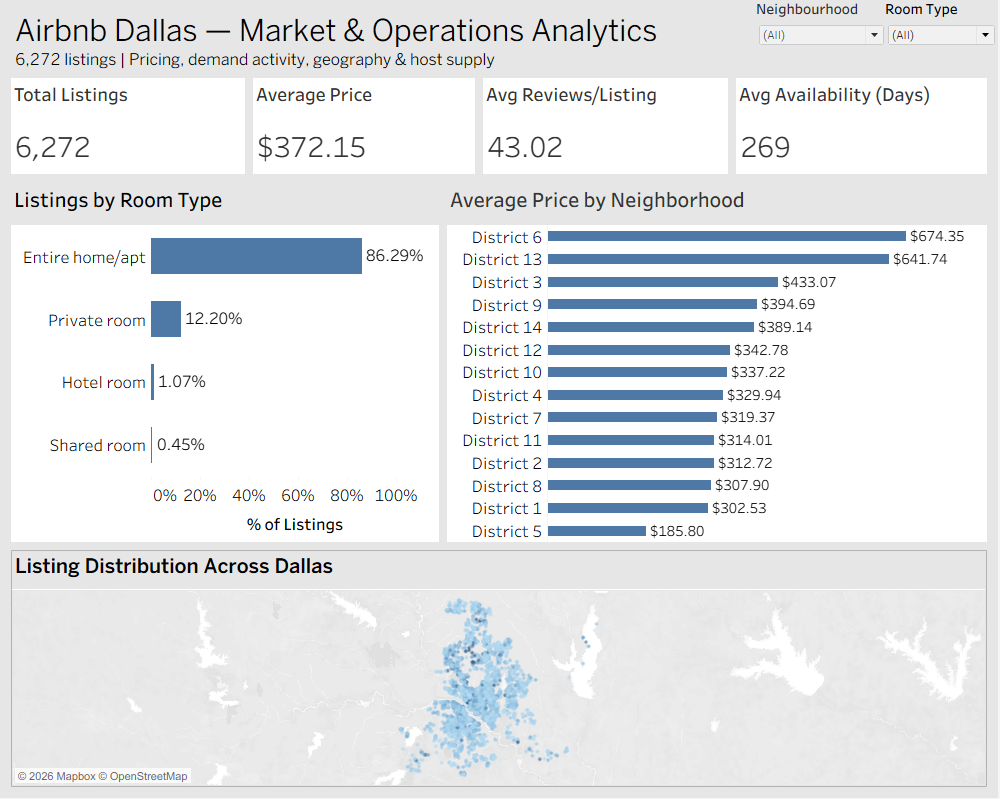

# Airbnb Dallas Market & Operations Analytics

An end-to-end analytics project analyzing Airbnb listings in Dallas to understand pricing, guest activity, neighborhood differences, and host portfolio behavior.

## Project Overview

This project analyzes 6,272 Airbnb listings in Dallas using Python, SQL Server, and Tableau.

The goal was to turn raw listing data into actionable insights around:

- Pricing and market segmentation
- Neighborhood-level differences
- Guest activity
- Room-type distribution
- Host portfolio concentration
- Availability and operational patterns

The project follows an end-to-end analytics workflow:

**Python → SQL Server → Tableau**

---

## Business Questions

The analysis focused on several key business questions:

1. What does the Dallas Airbnb market look like overall?
2. How does pricing vary across neighborhoods and room types?
3. Which neighborhoods show higher levels of recent guest activity?
4. How is the market distributed across different price segments?
5. How concentrated is Airbnb listing supply among multi-property hosts?
6. How do luxury listings differ from non-luxury listings?
7. Which premium listings combine higher prices with strong recent guest activity?

---

## Tools & Technologies

- **Python** — data cleaning and preparation
- **Pandas** — data manipulation and quality checks
- **SQL Server** — business analysis and segmentation
- **Tableau** — interactive dashboards and visualization
- **GitHub** — project documentation and versioned portfolio

---

## Data Preparation

The original dataset contained 6,574 listings and 19 columns.

The data preparation process included:

- Removing columns that were completely missing
- Handling missing review-related values
- Converting date fields to appropriate formats
- Filling missing minimum-night values using the median
- Removing unnecessary host profile fields
- Preserving nullable host information
- Identifying extreme price values
- Creating a price outlier flag
- Creating a capped price field for visualization

After cleaning, the analysis dataset contained:

**6,272 listings and 17 fields**

Extreme prices were flagged rather than removed so that the original market information remained available for analysis.

---

## SQL Analysis

SQL Server was used to analyze:

- Overall market metrics
- Room-type pricing and supply
- Neighborhood pricing
- Neighborhood pricing relative to the market average
- Median neighborhood prices
- Host portfolio segmentation
- Host supply concentration
- Recent guest activity
- Price segmentation
- Luxury vs. non-luxury listings
- High-activity premium listings
- Top listings by neighborhood

The complete SQL analysis is available in:

[`sql/airbnb_analysis.sql`](sql/airbnb_analysis.sql)

---

## Tableau Dashboards

### 1. Executive Overview

Provides a high-level view of:

- Total listings
- Average price
- Average reviews
- Average availability
- Room-type distribution
- Neighborhood pricing
- Geographic listing distribution



---

### 2. Pricing & Demand

Explores:

- Price segment distribution
- Price segments by room type
- Recent guest activity by neighborhood
- Luxury vs. non-luxury listings


---

### 3. Host Portfolio Distribution

Analyzes:

- Host data and Listings under them
- Average price by host type
- Availability by host type
- Recent guest activity by host type


---

## Key Findings

### Market Structure

- The dataset contains **6,272 Airbnb listings**.
- The average listing price is approximately **$372 per night**.
- **86.3%** of listings are entire homes/apartments.
- Mid-range listings ($150–$299) represent approximately **38.3%** of total supply.

### Neighborhood Pricing

- **District 6** has the highest average listing price at approximately **$674**.
- **District 13** follows at approximately **$642**.
- Districts 1 and 2 combine relatively lower average prices with higher levels of recent guest activity.

### Host Supply

Approximately **67.8% of known-host listing supply** is associated with multi-property hosts.

This indicates that a substantial portion of the Dallas Airbnb market is supplied by hosts operating multiple listings rather than individual single-property hosts.

### Luxury Listings

Luxury listings, defined as listings priced at $600 or more:

- Average approximately **$1,361 per night**
- Represent approximately **11.3%** of listings
- Show lower recent review activity than non-luxury listings
- Have similar overall availability to non-luxury listings
- Tend to have shorter minimum-night requirements

Recent reviews are used as a **proxy for recent customer activity**, rather than as a direct measure of demand.

---

## Business Recommendations

### 1. Focus on high-activity value markets

Districts with relatively strong recent guest activity and lower-than-market pricing may provide opportunities for hosts seeking to compete through value positioning.

### 2. Differentiate premium listings

Higher-priced listings should emphasize features that justify premium pricing, such as location, amenities, property quality, and guest experience.

### 3. Monitor multi-property operators

Because multi-property hosts account for a large share of known listing supply, their pricing and availability strategies can have a meaningful impact on competitive conditions.

### 4. Use neighborhood-level pricing strategies

Average market pricing varies substantially across neighborhoods. Hosts should consider neighborhood-specific competitive pricing rather than relying solely on city-wide averages.

### 5. Evaluate luxury performance separately

Luxury listings should be evaluated using metrics beyond price alone, including recent guest activity, availability, minimum stay requirements, and property characteristics.

---

## Project Structure

```text
airbnb-dallas-market-analytics/
│
├── sql/
│   └── airbnb_analysis.sql
│
├── Airbnb-Market_Analytics.twbx
├── Executive_Overview.png
├── Host Portfolio Distribution.png
├── Pricing & Demand.png
├── data_cleaning.ipynb
└── README.md
```

### Limitations

- Recent review counts are used as a proxy for customer activity and do not represent direct booking demand.
- Listing availability represents calendar availability and does not directly measure occupancy.
- Price analysis reflects listed prices rather than realized booking prices.
- Neighborhood comparisons with fewer listings should be interpreted cautiously.
- The analysis is descriptive and does not establish causal relationships.

### Data Source

Data sourced from **Inside Airbnb**, using Dallas listing data.

The raw dataset is not included in this repository. The cleaned data was used for analysis in SQL Server and Tableau.

### Skills Demonstrated

**Data Analytics:**  
Data cleaning, exploratory analysis, segmentation, trend analysis, business insight generation

**SQL:**  
Aggregations, GROUP BY, CASE statements, CTEs, window functions, ranking, percentiles, filtering

**Visualization:**  
Tableau dashboards, calculated fields, geographic analysis, KPI design, interactive filters

**Business Analysis:**  
Market segmentation, competitive pricing analysis, operational analysis, recommendation development


  
